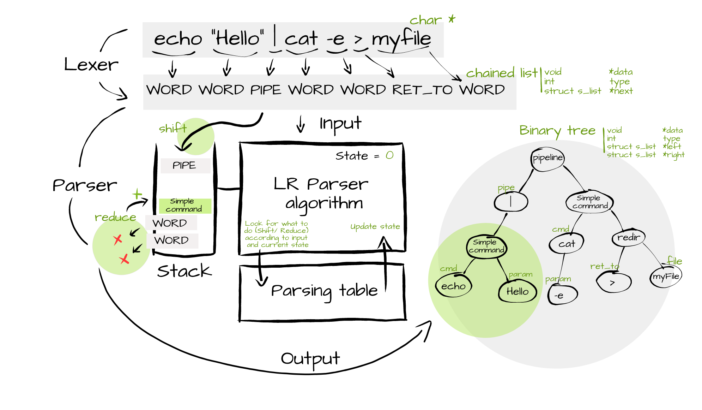
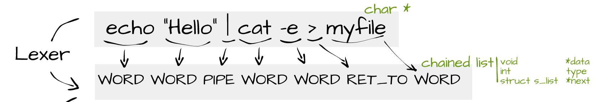
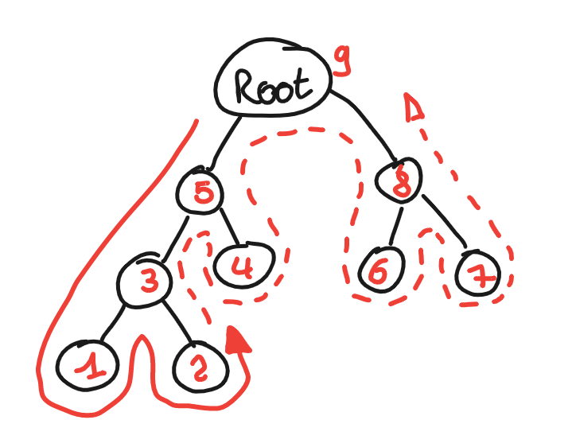
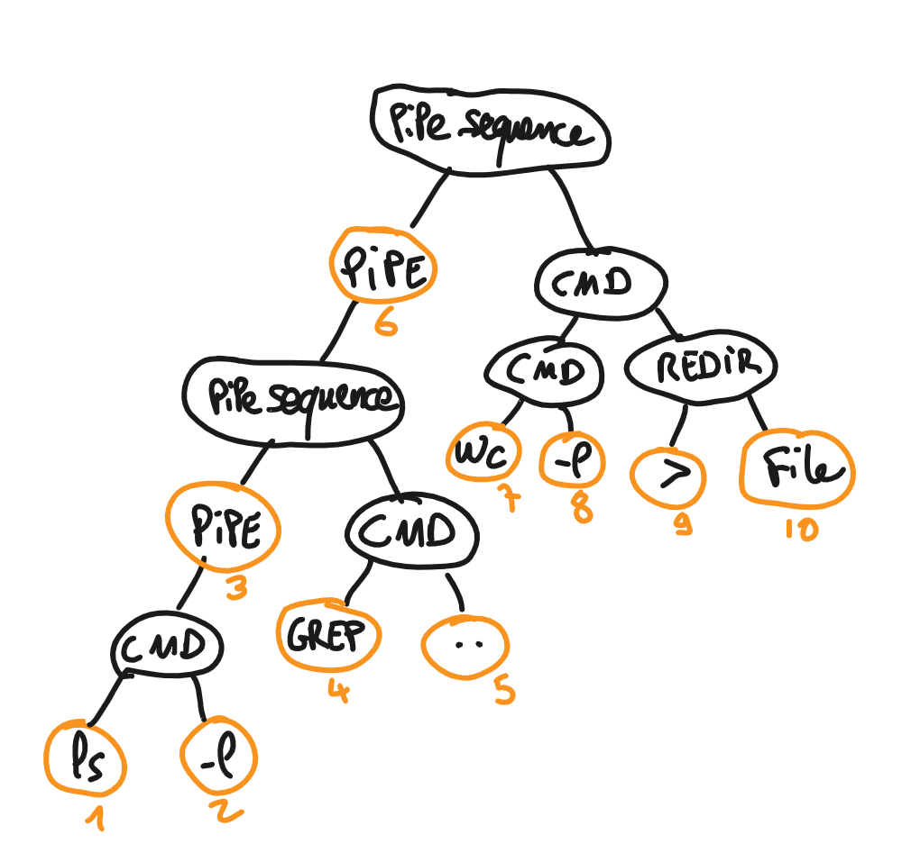
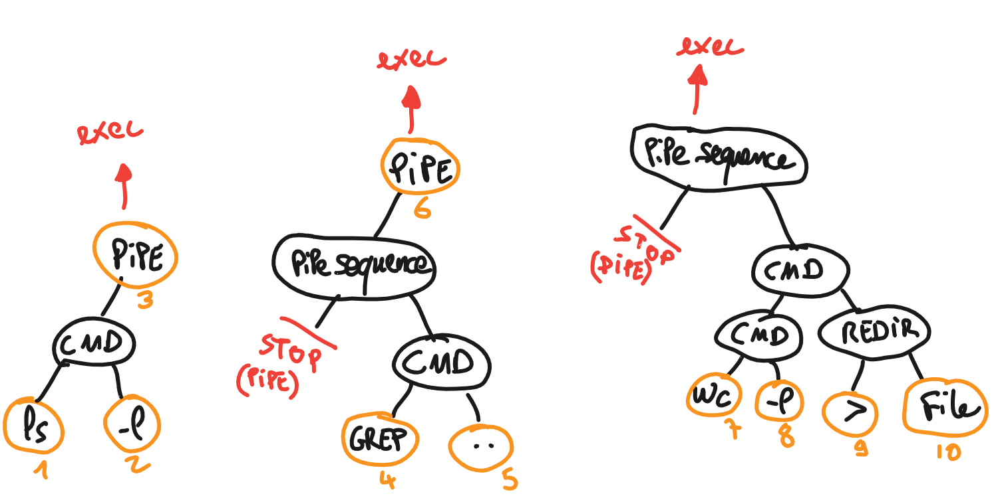

# Welcome to minishell 🐚 

This project is about creating a shell called **Minishell** based on [bash](https://fr.wikipedia.org/wiki/Bourne-Again_shell) with a reduced set of rules.

Minishell should be able to parse commands (simple commands, pipes, redirections), execute them properly, handle environment variables, keep an history of the commands and of course handle all kind of errors and interruptions.

⚠️ **Before even starting** to work on a shell which should reproduce the behavior of bash, I highly recommend reading the [bash manual](https://linux.die.net/man/1/bash). ⚠️

# Table of Contents
1. [Parser](#parser)
	- [LR Parser principle](#lr-parser-principle)
	- [Lexer - Lexical analysis](#lexer---lexical-analysis)
	- [Parser - Syntax analysis](#parser---syntax-analysis)
	- [Parsing table](#parsing-table)
2. [Interpreter](#interpreter)
	- [Interpreter principle](#interpreter-principle) 
	- [Tree visit](#tree-visit)
	- [Pipeline execution](#pipeline-execution)
	- [Redirection](#redirection)

# Parser
The parser is the part of the program responsible to **read, understand and translate** a command to a format the interpreter is able to work with. It is also responsible to **check the validity** of the input regarding a defined set of **rules** and to rise an error if the command is not valid.

Some interesting reads on the subject :
* [Guide to parsing (tomassetti.me)](https://tomassetti.me/guide-parsing-algorithms-terminology/)
* [Parsing explained (computerphile)](https://www.youtube.com/watch?v=bxpc9Pp5pZM&ab_channel=Computerphile)

## LR Parser principle
After some research, we decided to set up an LR parser (LR for **L**eft-to-right, **R**ightmost derivation in reverse : reads input text from left to right without backing up, and produces a rightmost derivation in reverse).

The LR Parser is a **bottom-up parser**. That means that it will try to **recognize the input's lowest-level small details first**, before its mid-level structures, and leaving the highest-level overall structure of the command line to last.

Some interesting reads on the subject :
* [Shell Grammar (opengroup.org)](https://pubs.opengroup.org/onlinepubs/9699919799.2018edition/utilities/V3_chap02.html#tag_18_10)
* [LR Parsing introduction (Education 4u)](https://www.youtube.com/watch?v=LIYZ0qSn6-k&ab_channel=Education4u)
* [Shift Reduce parser (geeksforgeeks.org)](https://www.geeksforgeeks.org/shift-reduce-parser-compiler/)

Below is a global view of the parser. We will detail these parts in the next steps.



<br />

## Lexer - Lexical analysis



The work of the lexical analyser or **lexer** is to identify token in the input string according to certain lexical rules.

For bash, you can find some documentation about token recognition online : [Shell token recognition (opengroup.org)](https://pubs.opengroup.org/onlinepubs/9699919799.2018edition/utilities/V3_chap02.html#tag_18_03)

> **NOTE :** Working with token instead of "words" will be much more comfortable when it will come to recognize grammar structure into the command line.

<br />

## Parser - Syntax analysis

An important step for parsing is to define the set of grammar rules you will try to match your command line with.

As the project consists of creating a simple shell based on bash, we chose to simplify the shell grammar available [here](https://pubs.opengroup.org/onlinepubs/9699919799.2018edition/utilities/V3_chap02.html#tag_18_10) :
```bnf
pipe_sequence	: simple_command 
				| pipe_sequence PIPE simple_command
				;
simple_command	: cmd_prefix cmd_word cmd_suffix
				| cmd_prefix cmd_word
				| cmd_prefix
				| cmd_name cmd_suffix
				| cmd_name
				;
cmd_name		: WORD
				;
cmd_word		: WORD
				;
cmd_prefix		: io_redirect
				| cmd_prefix io_redirect
				;
cmd_suffix		: io_redirect
				| cmd_suffix io_redirect
				| WORD
				| cmd_suffix WORD
				;
io_redirect		: io_file
				| io_here
				;
io_file			: RET_TO filename
				| RET_FROM filename
				| DGREAT filename
				;
filename		: WORD
				;
io_here			: DLESS here_end
				;
here_end		: WORD
				;
```

<br />

## Parsing table

In order to create the **parsing table**, we used a specific program called **Bison**. Bison is the [GNU](https://fr.wikipedia.org/wiki/GNU) version of yacc. It is a parser generator that can generate c code from a grammar.

As this code is not ok at all with the school norm and as it is not very right to get a generated code for a school project, we just used bison to create a textual **automaton** based on our grammar. From that automaton, we will deduce the **parsing table**.

Install bison :
```shell
$> apt-get install bison
```

Automaton creation :
```shell
$> bison -o gram.y
```
**gram.y** is the grammar in a specific format (the actual format from this readme with some additions).

From the above command, we get a textual automaton generated :
```text
state 0

    0 $accept: . pipe_sequence $end

    WORD      shift, and go to state 1
    RET_TO    shift, and go to state 2
    RET_FROM  shift, and go to state 3
    DLESS     shift, and go to state 4
    DGREAT    shift, and go to state 5

    pipe_sequence   go to state 6
    simple_command  go to state 7
    cmd_name        go to state 8
    cmd_prefix      go to state 9
    io_redirect     go to state 10
    io_file         go to state 11
    io_here         go to state 12


state 1

    8 cmd_name: WORD .

    $default  reduce using rule 8 (cmd_name)


state 2

   18 io_file: RET_TO . filename

    WORD  shift, and go to state 13

    filename  go to state 14

...
```
Then, we just use this automaton to create a **parsing table file** (manually, yes ...) that can be read using **get next line** function and feeded to a LR parser algorithm :

```
State | token type | action | next state | number of reduced tokens

0	0	0	1	-1
0	1	0	2	-1
0	2	0	3	-1
0	3	0	4	-1
0	4	0	5	-1
0 	100	-1	6	-1
0	101	-1	7	-1
0	102	-1	8	-1
0	104	-1	9	-1
0	106	-1	10	-1
0	107	-1	11	-1
0	109	-1	12	-1
1	-1	1	102	1
2	0	0	13	-1
2	108	-1	14	-1
3	0	0	13	-1
3	108	-1	15	-1
4	0	0	16	-1
...
```

To make this file easier to compute, we just used a small range of int values that match **enumerations** in the header files :

```h
typedef enum e_actions
{
	SHIFT,
	REDUCE,
	ACCEPT
}	t_actions;

typedef enum e_token_types
{
	T_END = -2,
	T_WORD = 0,
	T_RED_TO,
	T_RED_FROM,
	T_DLESS,
	T_DGREAT,
	T_PIPE	
}	t_token_types;

typedef enum e_rules
{
	R_PIPE_SEQUENCE = 100,
	R_SIMPLE_COMMAND,
	R_CMD_NAME,
	R_CMD_WORD,
	R_CMD_PREFIX,
	R_CMD_SUFFIX,
	R_IO_REDIRECT,
	R_IO_FILE,
	R_FILENAME,
	R_IO_HERE,
	R_HERE_END
}	t_rules;
```

For example, the line :
```
0	0	0	1	-1
```
can be read : `When you are in the STATE 0, if the token you read from input is a WORD, you must SHIFT this token from the input into the stack, then change the STATE to 1`. The last "-1" just means that the last parameter is not relevant for this line.

<br />

# Interpreter

## Interpreter principle

the principle of the interpretor is to browse the tree in POST ORDER, and to collect the right information in the right order to execute commands and pipes and redirection.

<br />

## Tree visit

We chose to visit the tree in POST ORDER, that means that we will start at the root of the tree, the explore left branch to the bottom, then right, and then have an action on the current node.

The algorythm looks like this:

```
visit(node)
    if node == null
        return ;
    visit(node->left)
    visit(node->right)
    <do something>
```



For a command like 
```sh
ls -l | grep .. | wc -l > file
```
the tree should be something like :



<br />

## Pipeline execution

Useful document: 
* [Shell implementation of pipelines (uleth.ca)](https://www.cs.uleth.ca/~holzmann/C/system/shell_does_pipeline.pdf).

This document explain the principle of creating a **subshell** to handle every command of the pipeline, then to **pipe** and **fork** before each command (except the last one which is executed in the subshell process and returns its exit status to minishell).

The principe with the tree is to browse the tree like in the schemas above and to stop on each **PIPE** node.
When we get a **PIPE** node, we fork the subshell then we execute the tree **from** the pipe node (which is considered as the root for this command).



When we browse a part of the tree from the root or from a pipe, we consider that we stop browsing the left branch if we encounter another pipe, to avoid executing a command twice.

Before launching a command, we have of course to create a pipe between this command and the previous and/or next one.
This is done by connecting the **STDOUT** of a command to the **STDIN** of the next command. We use [pipe](https://man7.org/linux/man-pages/man2/pipe.2.html) and [dup2](https://man7.org/linux/man-pages/man2/dup.2.html) for that.

<br />

## Redirection

The redirection is done in this project with **dup** and **dup2**.
Nothing too difficult but you need to think about saving STDIN and STDOUT if you execute the redirection within the main process (for builtins when you are not in a pipeline for example).

<br />

# Installation

Clone the repository:
```sh
git clone git@github.com:twagger/minishell.git
```
Make to create the **minishell** program:
```sh
make
```
Launch **minishell**
```sh
./minishell
```

# Authors

👨 **Thomas WAGNER**

* Github: [@twagger](https://github.com/twagger/)

👩 **Wen Tzu Lo**

* Github: [@iamwen1023](https://github.com/iamwen1023)
